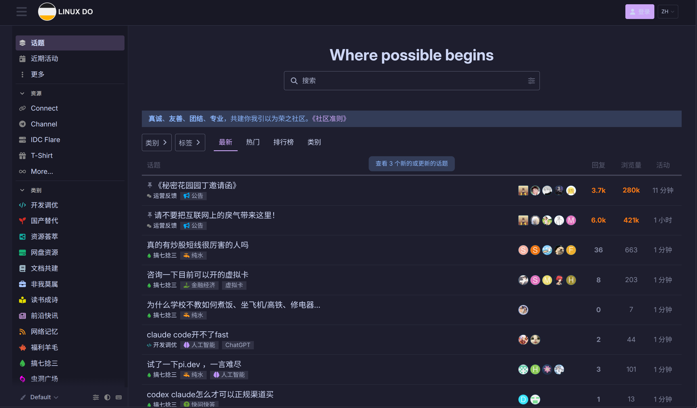

<h3 align="center">
	<br/>
	
	Catppuccin for <a href="https://linux.do">Linux DO</a>
	
</h3>

<p align="center">
	<a href="https://raw.githubusercontent.com/Okamitimo233/linux-do-catppuccin/main/catppuccin.user.less"></a>
	<a href="https://github.com/Okamitimo233/linux-do-catppuccin/issues"></a>
	<a href="https://github.com/Okamitimo233/linux-do-catppuccin/blob/main/LICENSE"></a>
</p>

<p align="center">
	<a href="./README_zh.md">简体中文</a>
</p>

<p align="center">
	Soothing pastel theme for the <a href="https://linux.do">Linux DO</a> community forum —<br/>
	a Catppuccin-flavored userstyle powered by Stylus.
</p>

&nbsp;

## ✨ Preview

<p align="center">
	
	
</p>

## 🎨 Flavors

Choose your preferred flavor from the Stylus popup:

| Flavor        | Light | Default            |
|---------------|-------|--------------------|
| 🐈 Latte      |  ✓    | ☀️ Light mode      |
| 🪶 Frappé     |       |                    |
| 🌺 Macchiato  |       |                    |
| 🌿 Mocha      |       | 🌙 Dark mode       |

Dark mode automatically uses the opposite palette.

## 🖌️ Accent Colors

Pick from 15 accent colors to personalize your experience:

<table>
  <tr>
    <td align="center"></td>
    <td><code>rosewater</code></td>
    <td></td>
  </tr>
  <tr>
    <td align="center"></td>
    <td><code>flamingo</code></td>
    <td></td>
  </tr>
  <tr>
    <td align="center"></td>
    <td><code>pink</code></td>
    <td></td>
  </tr>
  <tr>
    <td align="center"></td>
    <td><code>mauve</code></td>
    <td>✓ <strong>Default</strong></td>
  </tr>
  <tr>
    <td align="center"></td>
    <td><code>red</code></td>
    <td></td>
  </tr>
  <tr>
    <td align="center"></td>
    <td><code>maroon</code></td>
    <td></td>
  </tr>
  <tr>
    <td align="center"></td>
    <td><code>peach</code></td>
    <td></td>
  </tr>
  <tr>
    <td align="center"></td>
    <td><code>yellow</code></td>
    <td></td>
  </tr>
  <tr>
    <td align="center"></td>
    <td><code>green</code></td>
    <td></td>
  </tr>
  <tr>
    <td align="center"></td>
    <td><code>teal</code></td>
    <td></td>
  </tr>
  <tr>
    <td align="center"></td>
    <td><code>blue</code></td>
    <td></td>
  </tr>
  <tr>
    <td align="center"></td>
    <td><code>sapphire</code></td>
    <td></td>
  </tr>
  <tr>
    <td align="center"></td>
    <td><code>sky</code></td>
    <td></td>
  </tr>
  <tr>
    <td align="center"></td>
    <td><code>lavender</code></td>
    <td></td>
  </tr>
  <tr>
    <td align="center"></td>
    <td><code>subtext0</code></td>
    <td></td>
  </tr>
</table>

## 📦 Installation

### One-click install

Click the badge above, or open this link directly in your browser:

```
https://raw.githubusercontent.com/Okamitimo233/linux-do-catppuccin/main/catppuccin.user.less
```

Stylus will detect the userstyle and show an install dialog. Click **"Install style"** — done!

> [!TIP]
> Make sure [Stylus](https://github.com/openstyles/stylus) is installed first:  
> [Chrome Web Store](https://chrome.google.com/webstore/detail/stylus/clngdbkpkpeebahjckkjfobafhncgmne) · [Firefox Add-ons](https://addons.mozilla.org/firefox/addon/styl-us/)

### Manual install

1. Install the [Stylus](https://github.com/openstyles/stylus) extension
2. Open the Stylus popup → click **Manage**
3. Click **Write new style** → check **as UserCSS**
4. Paste the contents of [`catppuccin.user.less`](./catppuccin.user.less)
5. Click **Save**

## 🔧 Configuration

After installation, open the Stylus popup and click the gear icon next to **Linux DO Catppuccin** to adjust:

- **Light Flavor** — the palette used when your system/browser is in light mode
- **Dark Flavor** — the palette used in dark mode
- **Accent Color** — the highlight color for links, buttons, and interactive elements

Changes apply instantly — no page reload needed.

## 🧩 Features

- 🌗 Automatic light/dark mode detection via `prefers-color-scheme`
- 🎯 Discourse theme detection (respects `data-theme`, `.theme-dark`, `.dark`, etc.)
- 🎨 Full Catppuccin palette with 4 flavors × 15 accent colors
- 🖌️ Styled: header, sidebar, topic list, posts, buttons, inputs, modals, code blocks, scrollbar
- 🔄 Auto-update support via Stylus

## 🤝 Contributing

Found a bug or want to improve the theme? Contributions are welcome!

1. Fork this repository
2. Create a branch: `git checkout -b fix/thing`
3. Edit `catppuccin.user.less`
4. Submit a pull request

Please open an [issue](https://github.com/Okamitimo233/linux-do-catppuccin/issues) first for larger changes.

## 📄 License

[MIT](./LICENSE) © Catppuccin

&nbsp;

<p align="center">
	
</p>

<p align="center">
	Copyright &copy; 2021-present <a href="https://github.com/catppuccin" target="_blank">Catppuccin Org</a>
</p>
